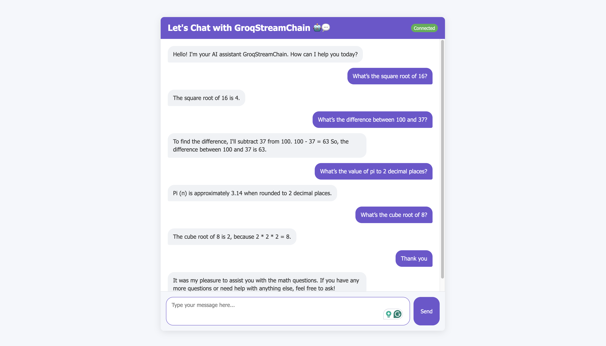

[](https://www.python.org/downloads/)
[](https://fastapi.tiangolo.com/)
[](https://developer.mozilla.org/en-US/docs/Web/API/WebSocket)
[](https://www.langchain.com/)
[](https://groq.com/)
[](https://github.com/pr0mila/GroqStreamChain/blob/main/LICENSE)
[](https://github.com/pr0mila/GroqStreamChain/issues)
[](https://github.com/pr0mila/GroqStreamChain/commits/main)
# GroqStreamChain: Real-Time AI Chat System

## Overview

GroqStreamChain is a real-time, AI-powered chat application that uses WebSocket for low-latency communication and streams responses from a language model (LLM) powered by Groq and LangChain. The system is designed to provide a seamless conversational experience with real-time feedback and response streaming.

## Project Structure

The system is organized into separate modules, each with specific responsibilities:

- **`server.py`**: Main FastAPI application with WebSocket handling.
- **`config.py`**: Configuration management (e.g., API keys, model settings).
- **`models/chat.py`**: Data models for chats and messages.
- **`services/llm_service.py`**: LLM service using Groq and LangChain for AI-powered responses.
- **Frontend Files**: HTML, CSS, and JS files for the user interface.

## Key Features

1. **WebSocket Communication**: Provides real-time, low-latency communication between the client and server.
2. **Streaming Responses**: The system streams LLM responses chunk by chunk to the client, improving perceived latency and enhancing the user experience.
3. **Session Management**: Automatically creates and maintains unique chat sessions for each user interaction.
4. **Clean Frontend**: A simple, responsive UI with typing indicators and message formatting for a smooth user experience.
5. **Error Handling**: Handles WebSocket disconnections and reconnection attempts gracefully.

## How to Run the Project

### 1. Clone the project:

First, clone the project from GitHub using the following command:

```bash
git clone https://github.com/pr0mila/GroqStreamChain.git
```

### 2. Install the required dependencies:

#### Create a Conda Environment (optional but recommended)

```bash
conda create --name streamchain python=3.9
conda activate streamchain
```

#### Install dependencies via `requirements.txt`:

```bash
pip install -r requirements.txt
```

Or install dependencies manually using `pip`:

```bash
pip install fastapi uvicorn websockets python-dotenv groq langchain langchain-groq pydantic jinja2
```

### 3. Set up environment variables:

Create a `.env` file in the project directory and set the following variables:

```bash
GROQ_API_KEY=your_groq_api_key_here
MODEL_NAME=llama-3.1-8b-instant
```

Make sure to replace `your_groq_api_key_here` with your actual Groq API key.

### 4. Run the server:

```bash
python server.py
```

This will start the FastAPI server, and you can access the application via the browser at:

[http://localhost:8000](http://localhost:8000)

## Final View of the GroqStreamChain

Here is the final view of the GroqStreamChain chat application:




## Running the Test Script (`test_groq.py`)

To test if the Groq API is working properly, you can run the test script `test_groq.py`. This script will send a test request to the Groq API and check if the response is correctly received.

### Steps to Run `test_groq.py`:

1. Make sure you have set up the `.env` file with your **Groq API key** and **model name**.

2. Run the following command to execute the test:

    ```bash
    python test_groq.py
    ```

3. The script will print out the response from the Groq API. If the API is working properly, you should see a successful connection and the response from the model.

4. If there are any issues with the API key or connectivity, the script will log an error message.


## Performance Considerations

- **WebSocket Connection**: The system maintains a persistent WebSocket connection to minimize connection overhead and ensure continuous communication between the client and server.
- **Streaming Responses**: The system streams LLM responses as they are generated, showing partial responses to the user immediately, reducing perceived latency.
- **Minimal Processing**: The server-side processing is kept to a minimum, relying on the Groq client to handle the bulk of the work.
- **Efficient Message Handling**: Direct interaction with the Groq client ensures efficient token streaming
# GroqStreamChain: Real-Time AI Chat System

## Overview

GroqStreamChain is a real-time, AI-powered chat application that uses WebSocket for low-latency communication and streams responses from a language model (LLM) powered by Groq and LangChain. The system is designed to provide a seamless conversational experience with real-time feedback and response streaming.

## Project Structure

The system is organized into separate modules, each with specific responsibilities:

- **`server.py`**: Main FastAPI application with WebSocket handling.
- **`config.py`**: Configuration management (e.g., API keys, model settings).
- **`models/chat.py`**: Data models for chats and messages.
- **`services/llm_service.py`**: LLM service using Groq and LangChain for AI-powered responses.
- **Frontend Files**: HTML, CSS, and JS files for the user interface.

## Key Features

1. **WebSocket Communication**: Provides real-time, low-latency communication between the client and server.
2. **Streaming Responses**: The system streams LLM responses chunk by chunk to the client, improving perceived latency and enhancing the user experience.
3. **Session Management**: Automatically creates and maintains unique chat sessions for each user interaction.
4. **Clean Frontend**: A simple, responsive UI with typing indicators and message formatting for a smooth user experience.
5. **Error Handling**: Handles WebSocket disconnections and reconnection attempts gracefully.

## How to Run the Project

### 1. Clone the project:

First, clone the project from GitHub using the following command:

```bash
git clone https://github.com/pr0mila/GroqStreamChain.git
```

### 2. Install the required dependencies:

#### Create a Conda Environment (optional but recommended)

```bash
conda create --name streamchain python=3.9
conda activate streamchain
```

#### Install dependencies via `requirements.txt`:

```bash
pip install -r requirements.txt
```

Or install dependencies manually using `pip`:

```bash
pip install fastapi uvicorn websockets python-dotenv groq langchain langchain-groq pydantic jinja2
```

### 3. Set up environment variables:

Create a `.env` file in the project directory and set the following variables:

```bash
GROQ_API_KEY=your_groq_api_key_here
MODEL_NAME=llama-3.1-8b-instant
```

Make sure to replace `your_groq_api_key_here` with your actual Groq API key.

### 4. Run the server:

```bash
python server.py
```

This will start the FastAPI server, and you can access the application via the browser at:

[http://localhost:8000](http://localhost:8000)

## Final View of the GroqStreamChain

Here is the final view of the GroqStreamChain chat application:


## Running the Test Script (`test_groq.py`)

To test if the Groq API is working properly, you can run the test script `test_groq.py`. This script will send a test request to the Groq API and check if the response is correctly received.

### Steps to Run `test_groq.py`:

1. Make sure you have set up the `.env` file with your **Groq API key** and **model name**.

2. Run the following command to execute the test:

    ```bash
    python test_groq.py
    ```

3. The script will print out the response from the Groq API. If the API is working properly, you should see a successful connection and the response from the model.

4. If there are any issues with the API key or connectivity, the script will log an error message.


## Performance Considerations

- **WebSocket Connection**: The system maintains a persistent WebSocket connection to minimize connection overhead and ensure continuous communication between the client and server.
- **Streaming Responses**: The system streams LLM responses as they are generated, showing partial responses to the user immediately, reducing perceived latency.
- **Minimal Processing**: The server-side processing is kept to a minimum, relying on the Groq client to handle the bulk of the work.
- **Efficient Message Handling**: Direct interaction with the Groq client ensures efficient token streaming for real-time communication.

## Blog Post

For a detailed explanation and walkthrough of the project, check out the blog post on Medium:

[GroqStreamChain: Building a Real-Time AI Chat Application](https://medium.com/@promilaghoshmonty/groqstreamchain-chat-application-pngbuilding-491004f3e25d)


## License

This project is licensed under the MIT License - see the [LICENSE](LICENSE) file for details.
 for real-time communication.

## Blog Post

For a detailed explanation and walkthrough of the project, check out the blog post on Medium:

[GroqStreamChain: Building a Real-Time AI Chat Application](https://medium.com/@promilaghoshmonty/groqstreamchain-chat-application-pngbuilding-491004f3e25d)


## License

This project is licensed under the MIT License - see the [LICENSE](LICENSE) file for details.
